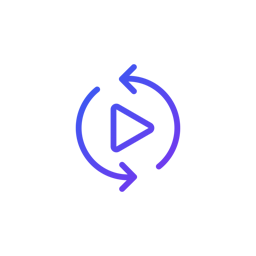
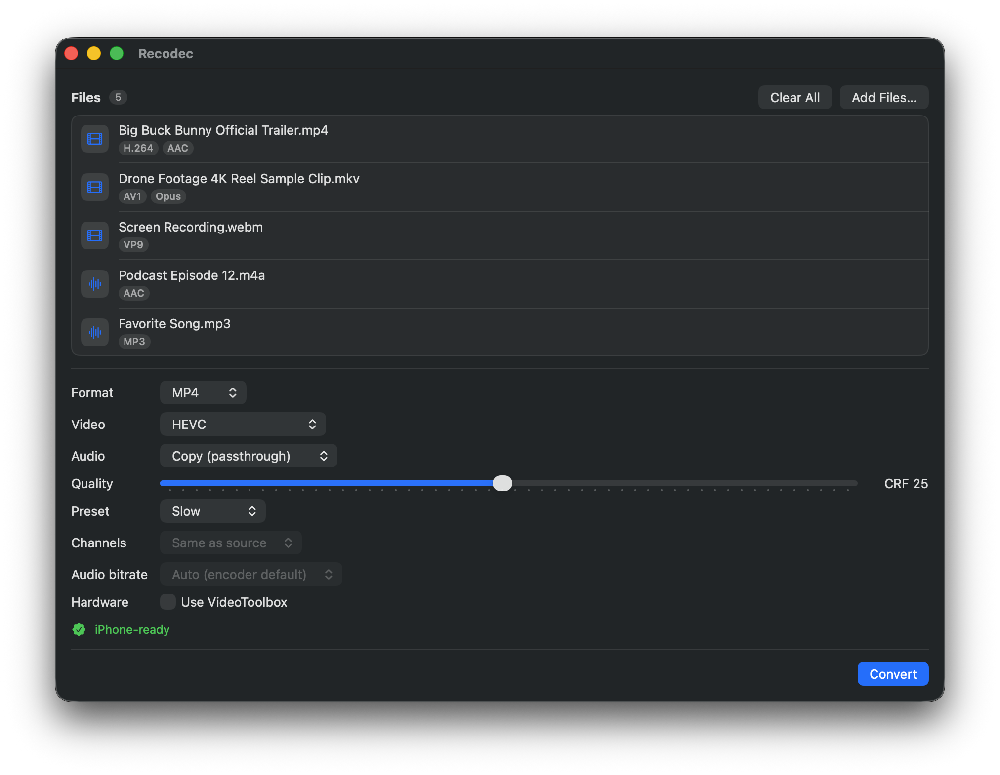

<div align="center">



# Recodec

**A simple, native macOS media converter — right-click to convert video and audio into iPhone-friendly formats, powered by ffmpeg.**



</div>

## Why I built this

macOS already puts an "Encode Selected Video Files" item in the Finder right-click menu, but it's built on AVFoundation (Apple's `avconvert`), which only understands a narrow set of codecs and containers. Hand it an MKV, a WebM, an AV1 or VP9 video, or many common audio formats and it simply won't touch them — there's nothing it can do with those files.

ffmpeg, on the other hand, reads and writes almost anything. Recodec keeps the convenience of a Finder right-click but backs it with ffmpeg, so the formats Apple's converter can't open or produce just work: select files, right-click **Convert Media** (or drag them onto the window), pick a target format, and go.

## Features

- **Right-click "Convert Media"** in Finder (a macOS Service), plus drag-and-drop and an Add Files… picker.
- **Batch convert** with per-file progress.
- **Containers:** MP4, MOV, M4V, MKV, WebM, M4A, MP3, GIF, FLAC, WAV.
- **Video:** H.264, HEVC, AV1, VP9, ProRes — or **Copy** (passthrough, no re-encode).
- **Audio:** AAC, MP3, ALAC, Opus, FLAC, PCM, AC-3, E-AC-3 — or Copy.
- **Controls:** per-codec quality (CRF), encoder preset, channels, audio bitrate, and optional VideoToolbox hardware encoding.
- **Live iPhone-ready badge** that reflects your current settings.
- Only codec/container combinations ffmpeg can actually mux are offered (the matrix is verified against ffmpeg, not guessed).

## Requirements

- macOS 13 (Ventura) or later
- [`ffmpeg`](https://ffmpeg.org/) installed on your machine (see below)

## Install ffmpeg (required)

Recodec needs `ffmpeg` and `ffprobe` available on your system:

```sh
brew install ffmpeg
```

Recodec checks for ffmpeg on launch and shows a hint if it's missing.

### Why isn't ffmpeg bundled?

Recodec is a thin, native front-end: it builds ffmpeg commands and shows you the results — it doesn't reimplement any encoding. Shipping ffmpeg *inside* the app is deliberately avoided, because:

- **ffmpeg moves fast.** Installing it through Homebrew means you get the newest codecs, fixes, and hardware support on ffmpeg's schedule — not whenever a bundled copy happens to be updated.
- **Licensing.** A full ffmpeg build (with x264/x265) is GPL; redistributing it inside an app pulls in licensing and notarization obligations that don't belong on a small tool. Recodec just *invokes* ffmpeg as a separate program, so its own code stays unencumbered.
- **Size & trust.** The app stays tiny, and you run the same ffmpeg you already trust rather than an unknown binary baked into someone else's bundle.

The trade-off is one extra step — `brew install ffmpeg`. Realistically, if you'd reach for a tool like this, you almost certainly have it already.

## Usage

1. **From Finder:** select one or more media files → right-click → **Convert Media**.
2. **Or:** open Recodec and drag files in, or click **Add Files…**.
3. Choose a format, codec, and quality; keep an eye on the **iPhone-ready** badge.
4. Click **Convert**. Converted files are written next to the originals.

## Build from source

Recodec uses [XcodeGen](https://github.com/yonaskolb/XcodeGen) to generate the Xcode project, and keeps its logic in a Swift package (`MediaConverterCore`) covered by tests.

```sh
brew install xcodegen ffmpeg
xcodegen generate          # creates Recodec.xcodeproj (git-ignored)
open Recodec.xcodeproj      # build & run in Xcode

# run the core tests
cd Packages/MediaConverterCore && swift test
```

## License

Recodec's own source is released under the MIT License. ffmpeg is separate software under its own license (LGPL/GPL) and is **not** bundled — Recodec calls the copy you install.
